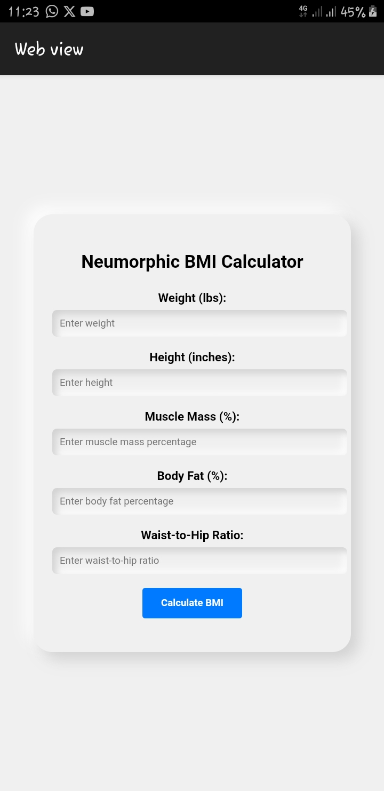

# Advanced BMI Calculator Documentation

The Advanced BMI Calculator is a web-based application that calculates Body Mass Index (BMI) with enhanced accuracy by considering additional factors such as muscle mass, body composition, and waist-to-hip ratio. This documentation provides an overview of the project, installation instructions, usage guidelines, contributing information, and license details.


## Table of Contents
- [features](#features)
- [problem](#problem)
- [solution](#solution)
- [why_the_solution_is_accurate](#why_the_solution_is_accurate)
- [case_study](#case_study)


## 

## Features
- Input fields for weight, height, muscle mass, body fat percentage, and waist-to-hip ratio.
- Calculates an adjusted BMI that accounts for additional factors.
- Provides a health classification based on the calculated BMI.
- Neumorphic user interface design for a modern and user-friendly experience.

## Problem:
The Body Mass Index (BMI) is a widely used method to assess whether a person has a healthy body weight relative to their height. However, traditional BMI calculations can sometimes be inaccurate and not fully account for various factors that influence an individual's health.

## Solution:
To address the limitations of traditional BMI calculations, you can implement an advanced BMI Calculator that takes into consideration additional factors such as muscle mass, body composition, and waist-to-hip ratio. This can provide a more accurate representation of a person's overall health status.

## Why_the_Solution_is_Accurate:
1. **Incorporating Body Composition:** Traditional BMI calculations only consider weight and height, which might not accurately reflect a person's body composition. By incorporating factors like muscle mass and body fat percentage, the advanced BMI Calculator provides a more comprehensive assessment of an individual's health.

2. **Waist-to-Hip Ratio:** The distribution of fat in the body is important for health assessment. Incorporating waist-to-hip ratio helps identify if a person has excess abdominal fat, which is associated with a higher risk of health issues like cardiovascular diseases.

3. **Personalization:** The advanced BMI Calculator can allow users to input additional information about their activity level, age, and gender. This personalization helps to provide a more tailored assessment of their health status.

## Case_Study:
Let's consider a case study involving two individuals:

Person A: Traditional BMI Calculation
- Weight: 180 lbs
- Height: 5'10" (70 inches)
- BMI = (180 lbs / (70 inches * 70 inches)) * 703 = 25.8 (Overweight)

Person B: Advanced BMI Calculation
- Weight: 180 lbs
- Height: 5'10" (70 inches)
- Muscle Mass: High due to regular strength training
- Body Fat Percentage: Low
- Waist-to-Hip Ratio: Healthy
- Activity Level: Active
- Gender: Male
- Age: 30

In this case study, while Person A might be classified as overweight using the traditional BMI calculation, the advanced BMI Calculator could classify Person B as healthy. This is because the advanced calculation takes into account additional factors that reflect Person B's overall health, including muscle mass, body composition, and lifestyle.

By implementing this advanced BMI Calculator, you can provide users with a more accurate and personalized assessment of their health status compared to the traditional BMI calculation. This can contribute to better health insights and decision-making.
---


For additional inquiries or support, contact [krisabundance@gmail.com](mailto:krisabundance@gmail.com).
```

