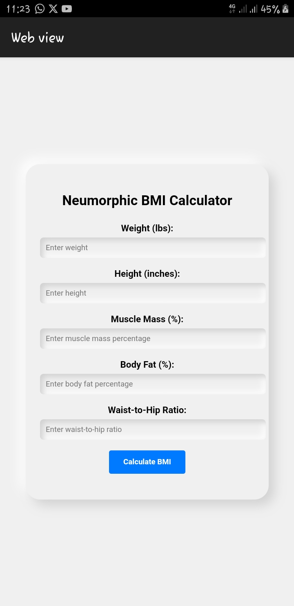

# Advanced-BMI-calculator
An Advanced BMI Calculator that takes into consideration additional factors such as muscle mass, body composition, and waist-to-hip ratio. This can provide a more accurate representation of a person's overall health status.
  
 ## Features 
 - Input fields for weight, height, muscle mass, body fat percentage, and waist-to-hip ratio. 
 - Calculates an adjusted BMI that accounts for additional factors. 
 - Provides a health classification based on the calculated BMI. 
 - Neumorphic user interface design for a modern and user-friendly experience. 
  
  
  
 ## Table of Contents 
 - [Installation](#installation) 
 - [Usage](#usage) 
 - [Contributing](#contributing) 
 - [License](#license) 
  
  
  
 ## Installation 
  
 1. Clone the repository to your local machine: 
  
    ```sh 
    git clone https://github.com/yourusername/advanced-bmi-calculator.git 
    ``` 
  
 2. Navigate to the project directory: 
  
    ```sh 
    cd advanced-bmi-calculator 
    ``` 
  
 3. Open the `index.html` file in a web browser to run the BMI Calculator. 
  
 ## Usage 
  
 1. Launch the application by opening the `index.html` file in a web browser. 
  
 2. Enter the required information in the input fields: 
    - Weight (lbs) 
    - Height (inches) 
    - Muscle Mass (%) 
    - Body Fat (%) 
    - Waist-to-Hip Ratio 
  
 3. Click the "Calculate BMI" button to view the calculated Advanced BMI and its classification. 
  
 4. The result will be displayed below the "Calculate BMI" button, indicating the calculated Advanced BMI and its associated classification (Underweight, Normal Weight, Overweight, Obese). 
  
 ## Contributing 
  
 Contributions to the Advanced BMI Calculator project are welcome! If you'd like to contribute, please follow these steps: 
  
 1. Fork the repository on GitHub. 
  
 2. Clone your forked repository to your local machine. 
  
 3. Create a new branch for your contribution: 
  
    ```sh 
    git checkout -b feature/your-feature-name 
    ``` 
  
 4. Make your changes and commit them. 
  
 5. Push your changes to your forked repository. 
  
 6. Create a pull request from your branch to the `main` (or `master`) branch of the original repository. 
  
 7. Provide a detailed description of your changes and their purpose. 
  
 ## License 
  
 The Advanced BMI Calculator project is licensed under the [MIT License](LICENSE). You are free to use, modify, and distribute this project, but please provide appropriate attribution and include the original license in your distribution. 
  
  
  
  
  
  
  
 --- 
  
 For additional inquiries or support, contact [krisabundance@gmail.com](mailto:krisabundance@gmail.com). 
 ``` 
 
